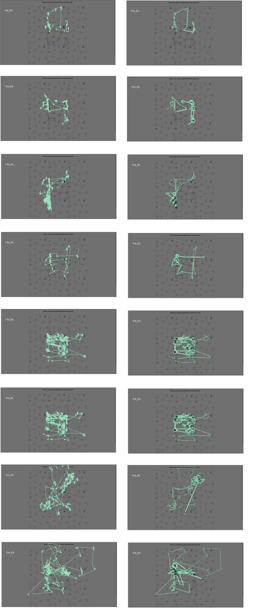
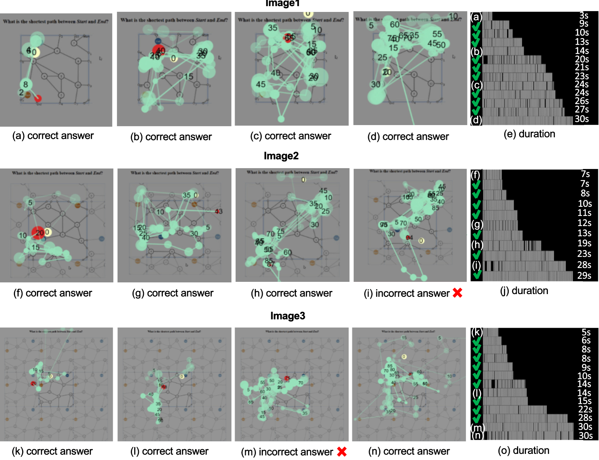
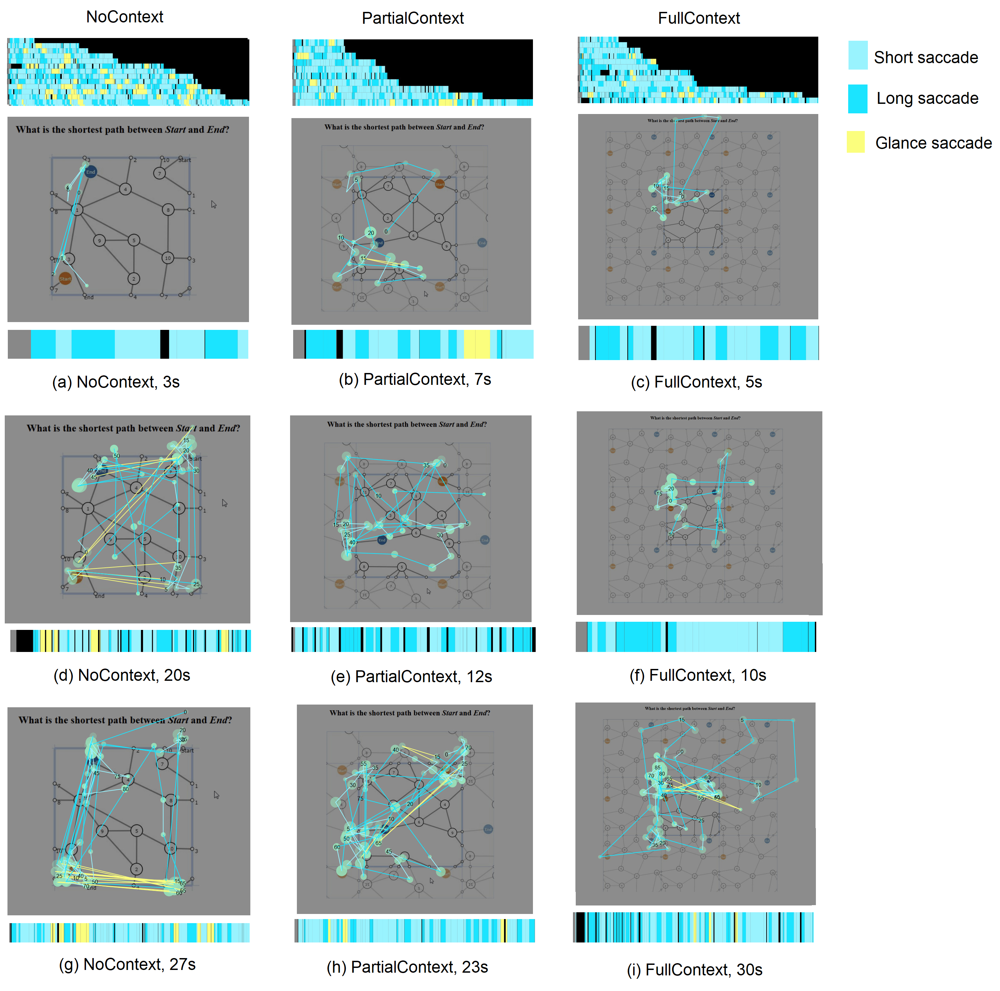
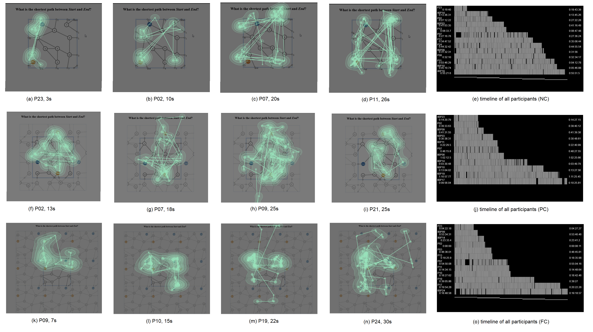
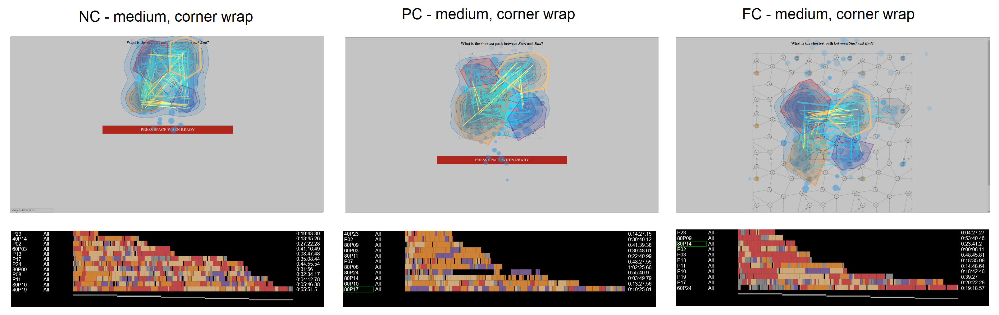
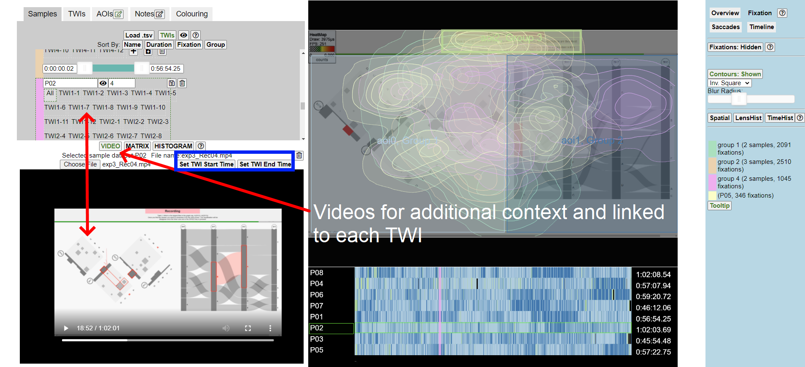
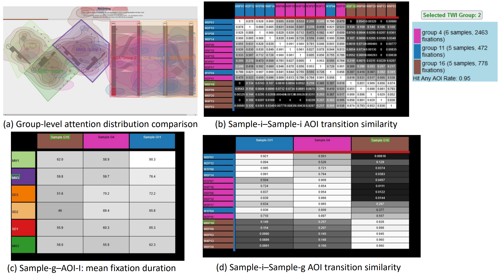
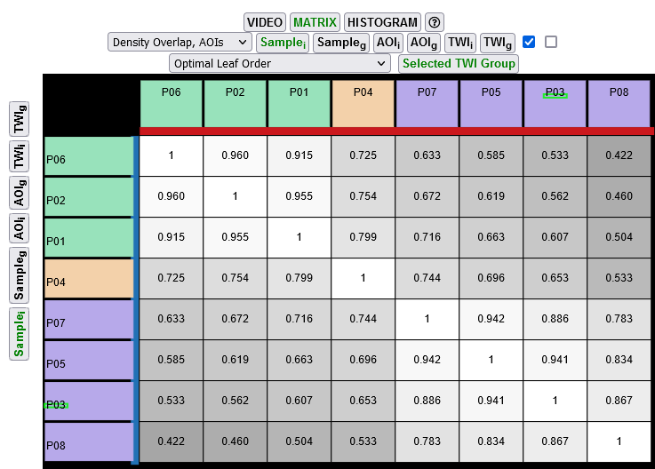
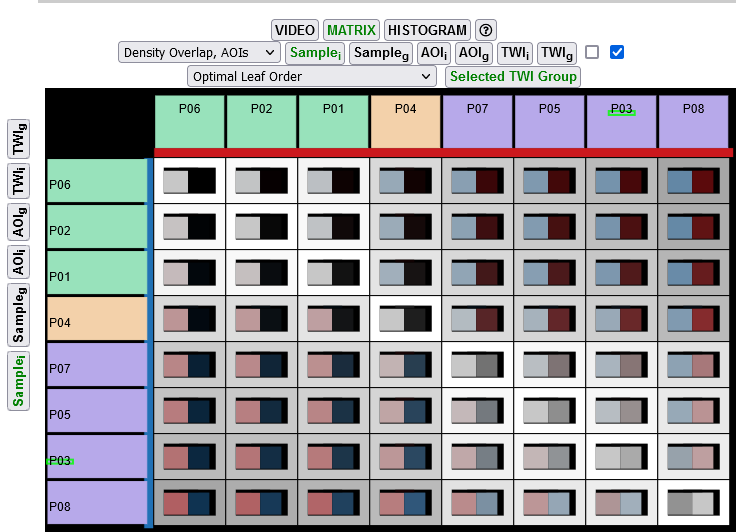
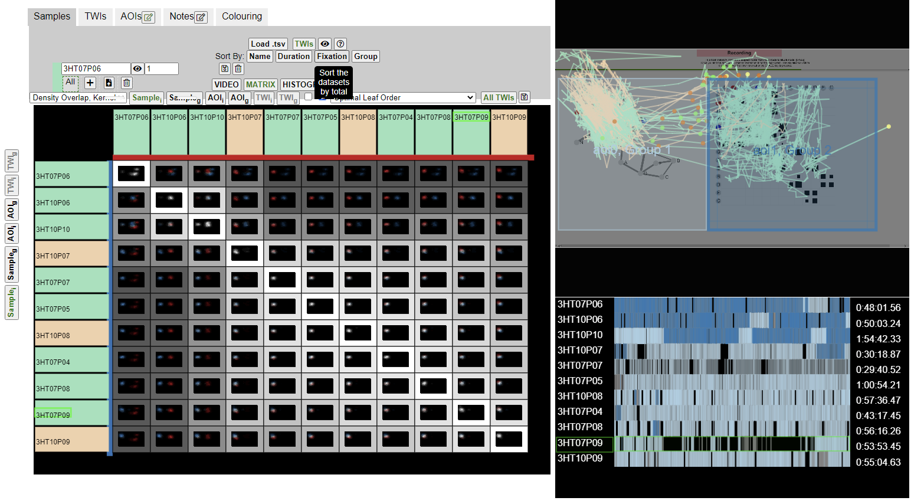

# Gazealytics: A Unified and Flexible Visual Toolkit for Exploratory and Comparative Gaze Analysis

## Introduction

Gazealytics is a sophisticated, web-based visual eye tracking analytics toolkit that features a unified combination of gaze analytics features that support flexible exploratory analysis, along with annotation of areas of interest (AOI), time-window of interest (TWI) and filter options based on multiple criteria to visually analyse eye tracking data across time and space. 

Gazealytics features coordinated views unifying spatiotemporal exploration of fixations, saccades and scanpaths for various analytical tasks. It aims to help eye tracking analysts to interactively explore eye tracking data. It allows analysts to visualize their data in various granuarlarity in overview, group, and individual level. Data can be grouped across samples, user-defined AOIs or TWIs to support aggregate or filtered analysis of gaze activity.

It supports a flexible interface for integration into analysts' existing workflow. User-defined samples, AOIs, and TWIs can be imported, where visual metrics results and their coordinated visualizations can be explored on the fly. The interface allows for exporting and restoring snapshot of analysis such as multicriteria parameters, AOIs, metrics, visualizations, and text annotation for post-analysis as well as for reporting purposes.

A live instance can be found at https://www2.visus.uni-stuttgart.de/gazealytics/.

## Citation
Chen, K. T., Prouzeau, A., Langmead, J., Whitelock-Jones, R. T., Lawrence, L., Dwyer, T., ... & Goodwin, S. (2023, May). Gazealytics: A Unified and Flexible Visual Toolkit for Exploratory and Comparative Gaze Analysis. In Proceedings of the 2023 Symposium on Eye Tracking Research and Applications (pp. 1-7). Preprint available at [arXiv:2303.17202](https://arxiv.org/pdf/2303.17202.pdf).

Please reference using the reference below:

@inproceedings{chen2023gazealytics,
  title={Gazealytics: A Unified and Flexible Visual Toolkit for Exploratory and Comparative Gaze Analysis},
  author={Chen, Kun-Ting and Prouzeau, Arnaud and Langmead, Joshua and Whitelock-Jones, Ryan T and Lawrence, Lee and Dwyer, Tim and Hurter, Christophe and Weiskopf, Daniel and Goodwin, Sarah},
  booktitle={Proceedings of the 2023 Symposium on Eye Tracking Research and Applications},
  pages={1--7},
  year={2023}
}

## Used by
Cai, M., Zheng, B., & Demmans Epp, C. (2022, July). Towards Supporting Adaptive Training of Injection Procedures: Detecting Differences in the Visual Attention of Nursing Students and Experts. In Proceedings of the 30th ACM Conference on User Modeling, Adaptation and Personalization (pp. 286-294).

Chen, K. T., Ngo, Q. Q., Kurzhals, K., Marriott, K., Dwyer, T., Sedlmair, M., & Weiskopf, D. (2023, May). Reading Strategies for Graph Visualizations that Wrap Around in Torus Topology. In Proceedings of the 2023 Symposium on Eye Tracking Research and Applications (pp. 1-7).

Pozdniakov, S., Martinez-Maldonado, R., Tsai, Y. S., Echeverria, V., Srivastava, N., & Gasevic, D. (2023, March). How Do Teachers Use Dashboards Enhanced with Data Storytelling Elements According to their Data Visualization Literacy Skills?. In LAK23: 13th International Learning Analytics and Knowledge Conference (pp. 89-99).

## Media
  * Visual eye tracking data analysis using Gazealytics was featured by [Merve Keskin](https://drmervekeskin.wordpress.com/) in [Geomob Podcast - 186. Merve Keskin: Map Usability](https://thegeomob.com/podcast/episode-186) (30:07 - 34:05) in producing more insightful outcomes with straightforward visualizations and interactions than traditional eye tracking data analysis methods.

## Requirements
  * This repository
  * Python 3.5 or above (web server scripting)

## Tutorial
There are some videos for getting started with gazealytics (whose previous release was named as webVETA).

  * The [features video](https://www.youtube.com/watch?v=TihdrjG0B8g&feature=youtu.be) of Gazealytics
  * The [setup video](https://www.youtube.com/watch?v=-vfOij3I3tc) which describes how to set up AOIs, TWIs, workspace etc
  * Example use case: [Group-level analysis using AOIs, fixations and Matrix tools](https://www.youtube.com/watch?v=00l1PMzEEx8)
  * Example use case: [Group-level analysis using scan paths](https://www.youtube.com/watch?v=LcieFoK3kh8)

More details can be found in Gazealytics paper: https://arxiv.org/pdf/2303.17202.pdf

## Features
Gazealytics implements a list of features/algorithms:

  * [Dispersion-based fixation detection algorithm (I-DT)](https://dl.acm.org/doi/10.1145/355017.355028)
  * AOI [sequence score](https://arxiv.org/abs/2005.14310); usage: comparing pairwise scanpath similarity by AOI visiting sequence, and string alignment according to
the [Needleman-Wunsch algorithm](https://www.sciencedirect.com/science/article/pii/0022283670900574)
  * Interactively achieving more suitable AOI definitions by improving AOI uncertainty metric, e.g., [hit-any-AOI-rate](https://dl.acm.org/doi/pdf/10.1145/3517031.3531166); 
  * [Saccade bundling](https://ieeexplore.ieee.org/abstract/document/6065028); usage: reduce visual clutter and better reveal scan path patterns  
  * [Matrix reordering](https://inria.hal.science/hal-01326759/document); usage: reveal visual patterns of fixations, saccades, scanpath based on similarity of individual or their group-level metrics. 

## Visual analysis examples
The examples below are meant to showcase Gazealytics's capabilities as a unified and flexible visual eye tracking analytics toolkit. It is ready to be integrated into users' existing data analysis workflow.


An exploration can begin at any stage of multi-way visual exploration (a-f) and move between them as shown by arrows. 
    

Multiple coordinated views of (a) data management panel; (b) spatial panel; (c) parameter control panel; (d) metric panel; (e) timeline panel.
The flexible user interface helps users to perform visual analysis across multiple eye tracking analytical tasks. 


Analytical results can be easily exported and integrated into users' own statistical testing pipeline.


Visual support of interactive exploration of AOIs. The coordinated views of spatial panel, quantitative visual metrics, and AOI sequence chart helps a user to find a more suitable AOI definition. 

## Visualizations
The examples below are meant to demonstrate Gazealytics's capability of visual analysis for multiple eye tracking analytical tasks.

### Raw gaze sequence visualization/scanpath visualization with fixation filtering
Data inspection before imposing any fixation filtering: Left: raw gaze sequence; Right: scanpath with fixation filtering. By default, Gazealytics implements Poole and Ball's dispersion-based algorithm (IDT).


### Coordinated views: Scanpath and timelines
Within-subject scanpath comparison of trials, ordered by task speed. The annotations (a)-(n) and tickes/crosses are done externally using Paint.



### Scanpath by saccade types 
Short/long/glance saccade, where short saccade cutoff can be set to a range between 0 and max pixels. For example, it is set to 100 pixels in this this illustration.




### Scanpath visualization with overlaid density maps
Scanpath can be drawn with density map (implemented in contours with Bell-curve) to gain both gaze sequence and fixation distribution.


Saccades are classified into short, long, glance types. Saccade filtering is applied to explore the gaze transitions between AOIs.



### Spatiotemporal visualization linked with TWI and video
Example of Gazealytics GUI layout showing data panel (upper left), spatial panel, video panel, timeline panel, and control panel (right).

Spatiotemporal visualizations can be linked with time-window-of-interests (TWI) and videos. When a specific TWI is chosen, the video will be automatically set to corresponding start time of the selected TWI. 



ps: known issue: synchronizing timeline when playing the gaze video is to be fixed

### Aggregated saccade visualization/saccade bundling

### Interactive annotation of area of interests

### Interactive visual aggregation and group level visualizations
An exploration can begin at any stage of multi-way visual exploration (a-d) with interactive visual grouping over samples, AOIs, and TWIs, and move between them (a-d).


### Data management panel: sample group/AOI group/TWI group

### Linking and brushing 

between metric panel and spatial/temporal views

between matrix relationships and spatial/termporal views)
AOI-AOI transitions

### Small multiples (minimaps)
fixation overlap matrix/visual metrics in matrix





density map matrix

### Resizable GUIs
GUI is flexible in adjusting the size of each canvas for analysts' specific analytical needs. 


### Export metrics for post-analysis

samples-AOIs

sample group-AOIs

time window of interest (TWI)-AOIs

### Matrix reordering

## Demo datasets
 * Load previously saved Gazealytics project files by clicking on "Load Project" - [Torus-wrapping graphs](https://arxiv.org/abs/2303.17066): [saved zip file-1](https://osf.io/kwve2), [saved zip file-2](https://osf.io/sc6by) 
 * Start from importing raw gaze sequence by clicking on "Load .tsv" and "Load background": [.tsv files and reference images](https://osf.io/au3bj/files/osfstorage)
 * Other saved project files and raw data: [Torus-wrapping graphs](https://osf.io/au3bj/)

## Development
To run Gazealytics from its source code simply run the following:

Download and install [miniconda](https://docs.conda.io/en/latest/miniconda.html)
```
conda install -c conda-forge ujson 
conda install -c conda-forge py 
conda install -c conda-forge numpy
conda install -c conda-forge pyopencl 
conda install -c conda-forge pocl
<the path to python3.7 binary> <the path to server.py>
```

This starts a server in development mode at http://localhost:8080/.
pyopencl is not required unless working with saccade bundling visualizations

## Team 
The toolkit is developed by:
  * Kun-Ting Chen (Centre for Research on Engineering Software Technologies, University of Adelaide)
  * Yao Wang (University of Stuttgart)
  * Sarah Goodwin (Monash University)

Past developers:
  * Joshua Langmead (Monash University)
  * Ishwari Bhade (Monash University)
  * Ryan T Whitelock-Jones (Monash University)

Main contributors:
  * Kun-Ting Chen (Centre for Research on Engineering Software Technologies, University of Adelaide)
  * Arnaud Prouzeau (Inria & LaBRI (University of Bordeaux, CNRS, Bordeaux-INP))
  * Joshua Langmead (Monash University)
  * Ryan T Whitelock-Jones (Monash University)
  * Lee Lawrence (Monash University)
  * Tim Dwyer (Monash University)
  * Christophe Hurter (ENAC, Université de Toulouse)
  * Daniel Weiskopf (University of Stuttgart)
  * Sarah Goodwin (Monash University)

## License
Gazealytics is provided under the MIT License.
